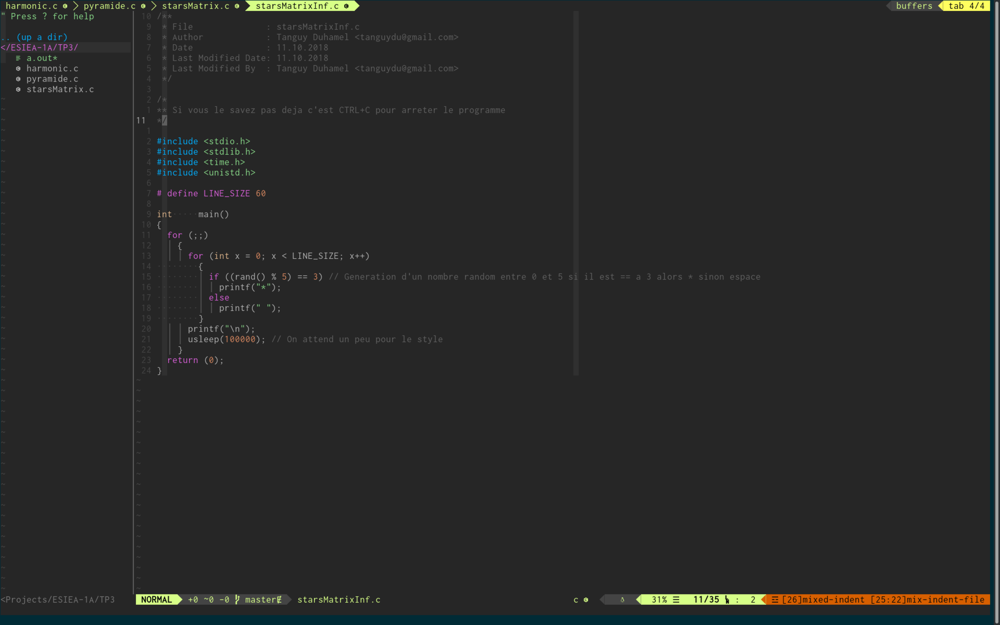

# ESIEA-1A

Les tps de 1A à l'ESIEA et peut-être d'autres choses.

## Cheat sheet

```bash
$ gcc fichier.c
```
Commande la plus simple, génère un executable __a.out__.

```bash
$ gcc -o [NOM] fichier.c
```
Génère un executable avec le nom donné.

## Pro tips
Dans vim CTRL+Z met vim en arrière-plan:

Puis CTRL+Z

On utilise la commande ```fg```pour revenir sur vim.
