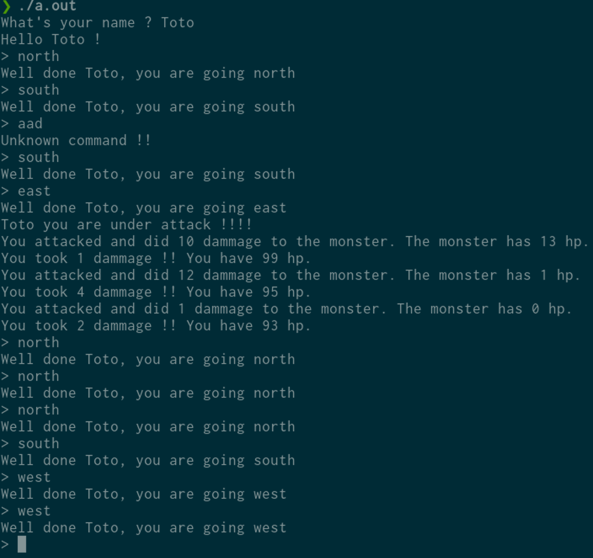

# MiniTextGame

L'idée c'est de mettre en pratique les TP2 et TP3 plus les fonctions mais avec un truc sympa.

__Seulement si t'es à l'aise avec les trucs du cours__

## But du jeu

Comme son nom l'indique c'est un jeu au format text. En gros, on est un bonhomme qui se déplace dans un monde
et qui se fait attaquer.
Donc pour se déplacer l'utilisateur entre les commandes suivantes:
```
north
south
east
west
```
T'as compris l'idée quoi(en vrai comme on a pas vraiment de monde c'est useless mais c'est pas grave).
Et en se baladant il se fait attaquer et doit se défendre.

Il a bien sur des points de vie.

## Les trucs en c à savoir

### Les chaînes de caractères

```c
char *str = "coucou";
```

Si tu sais pas ce que c'est bah c'est pas grave tu peux quand même t'en sortir.

Pour les récuperer avec __scanf__:
```c
char str[10]; // de taille 10
scanf("%s", str);
```

Pour comparer une chaîne de caractères à une autre:
```c
#include <string.h>

int main()
{
  if (!strcmp("cou", "coucou"))
    printf("cou == coucou\n");
  else
    printf("cou != coucou\n");
  return (0);
}
```
Si t'as pas compris les chaînes de caractères tu peux toujours utiliser des __char__.
```c
char c;
scanf("%c", &c);
```
Pour les comparer tu sais comment faire. Du coup pour se déplacer c'est:
```c
n
s
e
w
```

### Générer un nombre random
Pour savoir quand notre joueur est attaqué.
```c
#include <stdlib.h>
[...]
int rand_nbr = rand() % 10; // nombre random entre 0 et 10
```
---
Voilà normalement t'as ce qu'il te faut.

## Exemple de résultat

